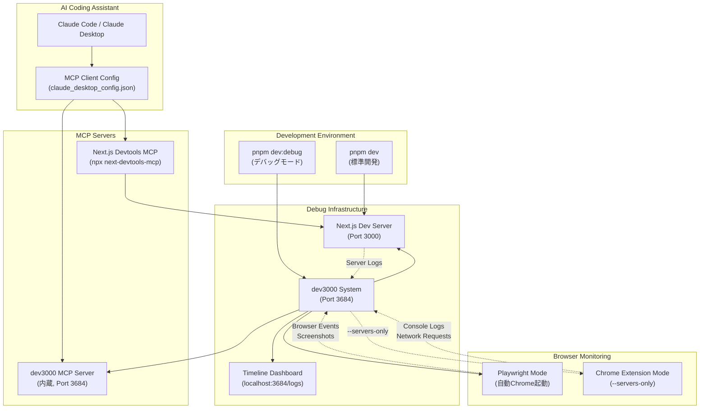
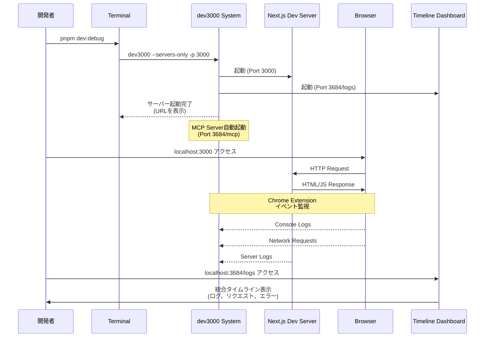
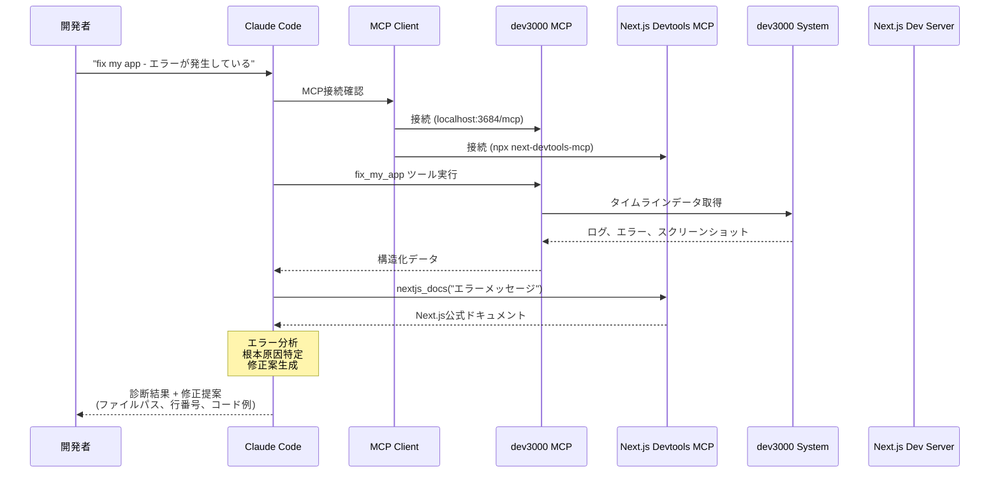
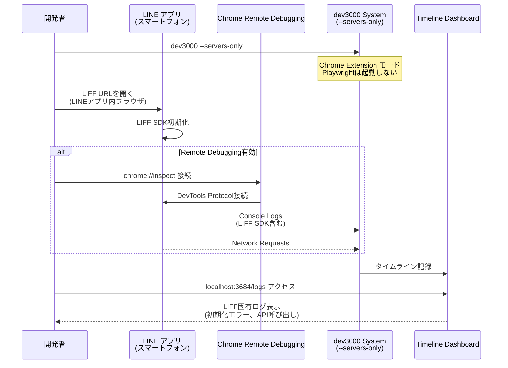
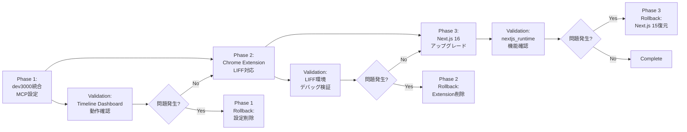

# Design Document: debug-environment

## Overview

本機能は、LINE Mini App Reversi プロジェクトにおける AI 支援開発を強化するため、包括的なデバッグツール（dev3000）を統合する。dev3000 はサーバーとブラウザの包括的な開発履歴記録を実現し、MCP Server を内蔵することで AI コーディングアシスタント（Claude Code）からの直接アクセスを可能にする。

**Purpose**: AI コーディングアシスタント（Claude Code）が、サーバーログ、ブラウザイベント、ネットワークリクエストの完全な文脈を持ってデバッグ支援を行えるようにする。これにより、エラーメッセージやスクリーンショットの手動共有が不要となり、問題診断の精度と速度が向上する。

**Users**: 本プロジェクトの開発者が、複雑な問題のデバッグ、E2E テスト失敗の診断、WebAssembly 統合の監視、Web アプリケーションの問題解決に利用する。

**Impact**: 既存の開発ワークフロー (`pnpm dev`) を維持しながら、必要時にオンデマンドで強力なデバッグ機能を起動できる環境を構築する。Phase 1-2 では Next.js 15 のまま dev3000 を統合し、Phase 3（Optional）で Next.js 16 アップグレード + Next.js Devtools MCP 統合を実施する。

### Goals

- サーバーログ、ブラウザイベント、ネットワークリクエストを統合タイムラインで記録する（Phase 1-2）
- Claude Code が MCP プロトコル経由でデバッグツール（dev3000 MCP Server）を利用できるようにする（Zero Configuration、Phase 1-2）
- 既存の開発ワークフロー（`pnpm dev`）に影響を与えずに、オンデマンドで起動可能なデバッグ環境を構築する（Phase 1-2）
- Next.js 内部状態（ルーティング、Server Actions、キャッシュ）への AI アクセスを確立する（Phase 3: Next.js Devtools MCP 統合、Optional）

### Non-Goals

- Next.js 16 への即座のアップグレード（Phase 3 で実施、既存実装への影響を最小化）
- 本番環境へのデバッグツール統合（開発環境専用）
- リアルタイム協調デバッグ機能（チーム間でのライブセッション共有）
- 自動化されたバグ修正（AI 支援診断のみ、修正判断は開発者が行う）
- デバッグデータの永続化とアナリティクス（セッション単位の一時的記録のみ）

## Architecture

### Existing Architecture Analysis

本プロジェクトは以下の技術スタックと設計原則を採用している：

- **Next.js 15 App Router** with Static Export (`output: 'export'`)
- **TypeScript strict mode** with Pure Functions優先のゲームロジック
- **Server/Client Component明確分離**（SSG最適化とクライアント実行の明確な境界）
- **pnpm + Husky + lint-staged** による品質ゲート自動化
- **Jest + Playwright** による多層テスト戦略

**制約事項**:

- Static Export (`output: 'export'`) モードのため、Server Actions や動的サーバーサイド機能は利用不可
- Next.js Devtools MCP の一部機能（Server Actions監視、動的キャッシュ分析）は Static Export 環境では制限される（Phase 3 で考慮）

**既存パターンの保持**:

- `pnpm dev` による標準開発フローは変更しない
- `package.json` scripts パターンに従い、新規デバッグコマンドを追加
- `.kiro/` ディレクトリによる開発ドキュメント管理を継続
- Husky/lint-staged による品質ゲート自動化は維持

### High-Level Architecture



**注記**: 上図は完全な構成（Phase 1-3 すべて完了時）を示しています。Phase 1-2 では **Next.js Devtools MCP は除外**され、dev3000 MCP Server のみを使用します。Next.js Devtools MCP は Phase 3（Next.js 16 アップグレード時）で追加されます。

**Architecture Integration**:

- **既存パターンの保持**: `pnpm dev` を変更せず、`pnpm dev:debug` を新規追加することで、通常開発とデバッグモードを明確に分離
- **新規コンポーネントの理由**:
  - **dev3000 System** (Phase 1-2): フレームワーク非依存の包括的記録により、Next.js以外のツール（WebAssembly）も監視可能、Zero Configuration で Claude Code から MCP 経由でアクセス可能
  - **Next.js Devtools MCP** (Phase 3, Optional): Next.js特有の内部状態（ルーティング、エラー構造）への型安全なアクセスを提供
- **Technology Alignment**: pnpm、TypeScript strict mode、既存のCI/CDパイプライン（Husky/lint-staged）との整合性を維持
- **Steering Compliance**:
  - CI/CD Standards: 品質ゲートを変更せず、デバッグツールは開発時オプションとして追加
  - Project Structure: `.kiro/` によるドキュメント管理を継続、新規設定ファイルは `/docs/` に配置
  - Type Safety: MCP Server通信でも型定義を明確化（後述のComponent Interfacesで詳述）

### Technology Alignment

本機能は既存技術スタックに以下の新規依存関係を追加する：

**新規グローバル依存関係** (Phase 1):

- **dev3000** (グローバルインストール推奨): `pnpm install -g dev3000`
  - 理由: 複数プロジェクトでの再利用性、プロジェクト依存関係の肥大化防止
  - バージョン: 最新安定版（パッケージマネージャーで管理）

**新規MCP Server依存関係** (Phase 3, Optional):

- **next-devtools-mcp** (`npx -y next-devtools-mcp@latest`)
  - Phase 3 で Next.js 16 アップグレード時に追加
  - Static Export 環境での制限事項: Server Actions監視、動的キャッシュ分析は利用不可
  - 利用可能機能: `nextjs_docs`（ドキュメント検索）、`browser_eval`（Playwrightブラウザ自動化）、`upgrade_nextjs_16`、`nextjs_runtime`（Next.js 16+）

**設定ファイルの追加**:

- `/docs/DEBUG_SETUP.md` (プロジェクトドキュメント、簡易セットアップガイド)

**既存パターンからの逸脱**:

- **なし**: 既存の開発フロー (`pnpm dev`)、テスト戦略、品質ゲートは変更しない
- **追加のみ**: `pnpm dev:debug` コマンドと関連ドキュメントを追加

### Key Design Decisions

#### Decision 1: Phase 分割 - Next.js 15 維持と Next.js 16 アップグレードの分離

**Context**:

- Next.js 16 は Turbopack デフォルト化、Async Request APIs完全削除、Middleware→Proxy名称変更など、多数の破壊的変更を含む
- 本プロジェクトは Static Export モードのため、Next.js 16 の主要機能（Cache Components、PPR）は利用不可
- Next.js Devtools MCP は Next.js 14+ で動作可能だが、一部機能（nextjs_runtime）は Next.js 16+ で最適化

**Alternatives**:

1. **即座に Next.js 16 へアップグレード**: Next.js Devtools MCP のフル機能を利用可能だが、破壊的変更への対応が必要
2. **Next.js 15 のまま dev3000 のみ導入**: MCP統合は限定的だが、リスクを最小化
3. **Phase分割（選択）**: Phase 1-2 で dev3000 + 基本MCP設定を実装し、Phase 3 で Next.js 16 アップグレードを実施

**Selected Approach**:

Phase分割アプローチを採用し、以下の3段階で実装する：

- **Phase 1**: dev3000 統合 + MCP Client設定（Next.js 15維持）
  - dev3000 グローバルインストール
  - `pnpm dev:debug` コマンド実装
  - Claude Desktop MCP設定（dev3000 MCP Server のみ）
  - 基本ドキュメント作成（README.md 更新 + /docs/DEBUG_SETUP.md 作成）

- **Phase 2**: Chrome Extension モード
  - Chrome Extension ベースの軽量監視モード実装
  - /docs/DEBUG_SETUP.md に Chrome Extension Setup 手順を追加

- **Phase 3**: Next.js 16 アップグレード + Next.js Devtools MCP 統合（Optional, 後回し）
  - Next.js Devtools MCP を MCP Client 設定に追加
  - `npx @next/codemod@canary upgrade latest` 実行
  - `nextjs_runtime` ツール活用（Next.js内部状態の直接アクセス）
  - Turbopack移行またはWebpack明示的指定（`--webpack`）

**Rationale**:

1. **リスク分離**: dev3000統合（Phase 1-2）と Next.js アップグレード（Phase 3）を分離することで、各フェーズの失敗が他に波及しない
2. **段階的価値提供**: Phase 1 完了時点で dev3000 による包括的ログ記録が利用可能になり、即座に開発効率が向上
3. **Static Export 環境への適合**: Next.js 16 の主要機能（Cache Components、PPR）は Static Export では利用不可のため、アップグレードの優先度は低い
4. **既存実装への影響最小化**: Phase 1-2 は既存コードベースを変更せず、設定とドキュメントの追加のみで完結

**Trade-offs**:

- **Gain**: Next.js 15 での安定性維持、破壊的変更への段階的対応、Phase 1-2 完了時点での即座の価値提供、Static Export 環境での実効性に集中（dev3000 のみ）
- **Sacrifice**: Next.js Devtools MCP は Phase 3 まで利用不可（Static Export 環境では主要機能が制限されるため影響は限定的）、Phase 3 実施時に MCP 設定の追加作業が発生

#### Decision 2: dev3000 のブラウザ監視モード - Chrome Extension を推奨

**Context**:

- dev3000 は2つのブラウザ監視モードを提供: Playwright（デフォルト）と Chrome Extension（`--servers-only`）
- Playwright モードは自動 Chrome 起動と自動スクリーンショットで強力だが、リソース消費が大きい
- Chrome Extension モードは軽量で、既存のブラウザセッションを利用可能

**Alternatives**:

1. **Playwright モードのみ**: 自動化は強力だが、リソース消費が大きい
2. **Chrome Extension モードのみ（選択）**: 軽量で、既存ブラウザセッションを利用可能

**Selected Approach**:

Chrome Extension モードを**推奨**とし、シンプルな運用を採用する：

- **推奨モード（Chrome Extension）**: `pnpm dev:debug` のデフォルト動作
  - コマンド: `dev3000 --servers-only`
  - 利点: 既存ブラウザセッション利用、低リソース消費、既存 E2E テストとの競合回避
  - セットアップ: Chrome Extension の手動インストールが必要（`/docs/DEBUG_SETUP.md` に手順記載）

- **代替モード（Playwright）**: 必要に応じて利用可能
  - コマンド: `dev3000`（オプションなし）
  - 対象: 自動スクリーンショット記録が必要な場合
  - 制約: リソース消費が大きい

**Rationale**:

1. **軽量性**: Playwright モードは Chrome インスタンスを自動起動するため、メモリ/CPU 使用量が高い。通常開発では Extension モードで十分
2. **既存ワークフローとの親和性**: 開発者は通常、ブラウザを手動で開いて開発するため、Extension モードがより自然
3. **E2E テストとの競合回避**: Playwright E2E テストと dev3000 Playwright モードの同時実行を避け、リソース競合を防ぐ

**Trade-offs**:

- **Gain**: 低リソース消費、既存ワークフローとの整合性、E2E テストとの競合回避
- **Sacrifice**: 自動スクリーンショット機能は Playwright モード切り替えが必要、Extension のインストール手順が必要

#### Decision 3: ドキュメント構造 - 複数ドキュメント戦略（README更新 + 専用ガイド）

**Context**:

- デバッグツールは設定手順、使い分け戦略、トラブルシューティングなど、ドキュメント量が多い
- プロジェクトには既存の README.md があるが、詳細なデバッグ手順で肥大化させるべきではない
- `.kiro/` は Kiro フレームワーク用のため、一般的な開発ドキュメントは `/docs/` に配置すべき

**Alternatives**:

1. **単一ドキュメント（README.md のみ更新）**: シンプルだが、README が長大化し可読性低下
2. **専用ガイドのみ（/docs/DEBUG_SETUP.md）**: 詳細だが、README から参照がないと発見されにくい
3. **複数ドキュメント（選択）**: README で概要とクイックスタート、/docs/ で詳細ガイド

**Selected Approach**:

複数ドキュメント戦略を採用し、以下の2ファイルで構成する：

- **README.md（既存ファイル更新）**:
  - 新規セクション追加: "## Debugging with AI Tools"
  - 内容: 概要（2-3行）、クイックスタートコマンド（`pnpm dev:debug`）、詳細ガイドへのリンク（`/docs/DEBUG_SETUP.md`）
  - 目的: プロジェクト参加者が即座にデバッグツールの存在を認識でき、詳細は専用ガイドに委譲

- **/docs/DEBUG_SETUP.md（新規作成）**:
  - 構成:
    1. Introduction（dev3000 の概要と利点）
    2. Installation（`pnpm install -g dev3000`）
    3. Usage（`pnpm dev:debug` コマンド、Timeline Dashboard へのアクセス）
    4. Chrome Extension Setup（シンプルな手順: Developer mode 有効化、Extension 読み込み、`dev3000 --servers-only` 起動）
    5. MCP Integration（Zero Configuration、Claude Code が自動的に dev3000 MCP Server にアクセス可能）
    6. Phase 3: Next.js 16 + Next.js Devtools MCP（Optional、将来の拡張）
  - 目的: シンプルなセットアップガイドを提供、既存ツール（dev3000）の活用方法にフォーカス

**Rationale**:

1. **情報の段階的開示**: README でデバッグツールの存在を周知し、詳細は専用ガイドに委譲することで、各ファイルの責務を明確化
2. **保守性**: デバッグツールの更新（新機能追加、トラブルシューティング追記）を /docs/DEBUG_SETUP.md で完結させ、README は最小限の更新で維持
3. **発見性**: README に明確なリンクを配置することで、新規参加者がドキュメントの存在を見逃さない
4. **構造化**: Kiro 仕様書（.kiro/specs/）とは独立した一般開発ドキュメント（/docs/）として管理

**Trade-offs**:

- **Gain**: 各ドキュメントの責務が明確、保守性向上、README の可読性維持
- **Sacrifice**: ドキュメントファイル数の増加（2ファイル）、開発者は詳細情報のために複数ファイルを参照する必要がある

## System Flows

### デバッグモード起動フロー



### AI デバッグ支援フロー（MCP経由）



### LINE LIFF 環境デバッグフロー



## Requirements Traceability

| Requirement | Requirement Summary      | Components                                                | Interfaces                                                     | Flows                                             |
| ----------- | ------------------------ | --------------------------------------------------------- | -------------------------------------------------------------- | ------------------------------------------------- |
| 1.1-1.6     | Next.js Devtools MCP統合 | Next.js Devtools MCP Server, MCP Client Config            | `nextjs_docs`, `browser_eval`, `upgrade_nextjs_16`             | AI デバッグ支援フロー                             |
| 2.1-2.7     | dev3000開発履歴記録      | dev3000 System, Timeline Dashboard, Chrome Extension Mode | dev3000 CLI, Dashboard UI                                      | デバッグモード起動フロー, LINE LIFFデバッグフロー |
| 3.1-3.5     | dev3000 MCP AI機能       | dev3000 MCP Server                                        | `fix_my_app`, `execute_browser_action`, `get_mcp_capabilities` | AI デバッグ支援フロー                             |
| 4.1-4.5     | 開発ワークフロー統合     | package.json scripts, Development Scripts                 | `pnpm dev`, `pnpm dev:debug`                                   | デバッグモード起動フロー                          |
| 5.1-5.5     | MCP Client設定           | MCP Client Config (claude_desktop_config.json)            | MCPサーバー接続設定                                            | AI デバッグ支援フロー                             |
| 6.1-6.5     | ドキュメント             | README.md, /docs/DEBUG_SETUP.md                           | 使い分け戦略、セットアップ手順、トラブルシューティング         | 全フロー                                          |
| 7.1-7.5     | LIFF環境対応             | Chrome Extension Mode, Remote Debugging Setup             | Chrome Extension, chrome://inspect                             | LINE LIFFデバッグフロー                           |
| 8.1-8.5     | パフォーマンス監視       | dev3000パフォーマンス設定                                 | 記録レベル調整、自動アーカイブ                                 | 全フロー（非機能要件）                            |

## Components and Interfaces

### Development Scripts Layer

#### pnpm dev:debug Command

**Responsibility & Boundaries**

- **Primary Responsibility**: dev3000 をサーバーのみモード（`--servers-only`）で起動し、Next.js 開発サーバーと Timeline Dashboard を同時起動する
- **Domain Boundary**: 開発ワークフロー自動化レイヤー
- **Data Ownership**: なし（起動トリガーのみ）
- **Transaction Boundary**: コマンド実行単位（起動失敗時はプロセス全体が終了）

**Dependencies**

- **Inbound**: 開発者による手動実行（`pnpm dev:debug`）
- **Outbound**:
  - dev3000 グローバルコマンド（`dev3000 --servers-only -p 3000`）
  - Next.js 開発サーバー（dev3000が起動）
- **External**:
  - dev3000 (グローバルインストール)
  - Node.js 24.x
  - Next.js 15.x

**External Dependencies Investigation**:

- **dev3000**:
  - インストール: `pnpm install -g dev3000` または `npm install -g dev3000`
  - 最新バージョン確認: GitHub Releases (<https://github.com/vercel-labs/dev3000/releases>)
  - 互換性: Node.js 20.19+ 推奨、Next.js 14+ 対応
  - 既知の問題: Playwright モードはメモリ消費が高い（`--servers-only` で回避可能）
  - パフォーマンス: サーバーログ記録のオーバーヘッドは通常 5% 未満

**Contract Definition**

**Service Interface**:

```typescript
// package.json scripts
interface DevScripts {
  // 標準開発モード（既存）
  dev: 'next dev';

  // デバッグモード（Chrome Extension推奨）
  'dev:debug': 'dev3000 --servers-only -p 3000 -s dev';

  // デバッグモード（Playwright）
  'dev:debug:playwright': 'dev3000 -p 3000 -s dev';
}
```

- **Preconditions**:
  - dev3000 がグローバルにインストール済み（`pnpm install -g dev3000`）
  - Next.js プロジェクトが有効（`package.json` に `"dev": "next dev"` が存在）
  - Port 3000, 3684 が利用可能
- **Postconditions**:
  - Next.js Dev Server が Port 3000 で起動
  - dev3000 MCP Server が Port 3684 で起動
  - Timeline Dashboard が `http://localhost:3684/logs` でアクセス可能
  - コンソールに起動完了メッセージと URL が表示される
- **Invariants**:
  - `pnpm dev` の動作は変更されない（既存ワークフロー保持）

#### pnpm dev:debug:playwright Command

**Responsibility & Boundaries**

- **Primary Responsibility**: dev3000 を Playwright モードで起動し、自動スクリーンショットと操作再現を有効化する
- **Domain Boundary**: 開発ワークフロー自動化レイヤー（高度なデバッグ用）
- **Data Ownership**: なし（起動トリガーのみ）

**Dependencies**

- **Inbound**: 開発者による手動実行（E2Eテスト失敗調査時など）
- **Outbound**: dev3000 グローバルコマンド（`dev3000 -p 3000`）
- **External**: dev3000 (グローバルインストール), Playwright (dev3000内蔵)

**Contract Definition**

**Service Interface**:

```typescript
// package.json scripts
interface AdvancedDevScripts {
  // Playwrightモード（自動Chrome起動）
  'dev:debug:playwright': 'dev3000 -p 3000 -s dev';
}
```

- **Preconditions**:
  - dev3000 がグローバルにインストール済み
  - Playwright 互換環境（Chromium実行可能）
  - 十分なシステムリソース（メモリ 2GB+ 推奨）
- **Postconditions**:
  - Next.js Dev Server が Port 3000 で起動
  - dev3000 が自動的に Chrome インスタンスを起動
  - Timeline Dashboard が自動スクリーンショット付きで記録
- **Invariants**:
  - `pnpm dev:debug` よりリソース消費が高い

### MCP Integration Layer

#### dev3000 MCP Server

**Responsibility & Boundaries**

- **Primary Responsibility**: dev3000 が記録したタイムラインデータ（ログ、エラー、スクリーンショット）を MCP プロトコル経由で AI アシスタントに提供する
- **Domain Boundary**: AI統合レイヤー（dev3000内蔵MCPサーバー）
- **Data Ownership**: タイムラインログ（一時ファイル、セッション終了時に削除）
- **Transaction Boundary**: MCP ツール呼び出し単位（ステートレス）

**Dependencies**

- **Inbound**:
  - Claude Code / Claude Desktop (MCP Client)
  - MCP Client Config (claude_desktop_config.json)
- **Outbound**:
  - dev3000 System（タイムラインデータ取得）
  - Browser（`execute_browser_action` による操作実行）
- **External**:
  - Model Context Protocol (MCP) 仕様準拠
  - dev3000 内蔵MCPサーバー（Port 3684）

**External Dependencies Investigation**:

- **Model Context Protocol (MCP)**:
  - プロトコル仕様: <https://modelcontextprotocol.io/docs>
  - Claude統合ガイド: <https://support.claude.com/en/articles/10949351>
  - 通信方式: stdio (Claude Desktop), HTTP/SSE (dev3000)
  - 認証: なし（localhost接続のみ）
  - 制限事項: dev3000 MCP Server は dev3000 プロセスが起動中のみ利用可能

**Contract Definition**

**MCP Tools Interface**:

```typescript
// dev3000 MCP Server が提供するツール
interface Dev3000MCPTools {
  /**
   * タイムラインデータを分析し、問題の診断結果を返す
   * @returns 構造化されたエラー分析、根本原因、修正提案
   */
  fix_my_app(): Promise<{
    errors: Array<{
      timestamp: string;
      type: 'server' | 'browser' | 'network';
      message: string;
      stackTrace?: string;
      screenshot?: string; // base64
    }>;
    rootCause: string;
    suggestions: string[];
  }>;

  /**
   * ブラウザ操作を実行し、結果を記録
   * @param action - 実行する操作（click, type, navigate, screenshot）
   * @param selector - 対象要素のCSSセレクター（clickの場合）
   * @param value - 入力値（typeの場合）
   */
  execute_browser_action(
    action: 'click' | 'type' | 'navigate' | 'screenshot',
    selector?: string,
    value?: string
  ): Promise<{
    success: boolean;
    screenshot?: string; // base64
    error?: string;
  }>;

  /**
   * 利用可能なMCP機能を取得（動的capability discovery）
   */
  get_mcp_capabilities(): Promise<{
    tools: string[];
    nextjsDevAvailable: boolean; // nextjs-dev MCP連携の有無
    chromeDevtoolsAvailable: boolean; // chrome-devtools MCP連携の有無
  }>;
}
```

- **Preconditions**:
  - dev3000 プロセスが起動中（`pnpm dev:debug` 実行済み）
  - MCP Client が正しく設定済み（claude_desktop_config.json）
- **Postconditions**:
  - `fix_my_app`: タイムラインから抽出したエラー情報を構造化して返す
  - `execute_browser_action`: ブラウザ操作実行後のスクリーンショットを記録
- **Invariants**:
  - dev3000 プロセスが停止すると MCP Server も停止
  - タイムラインデータは最大5分間キャッシュ（TTL）

**Error Handling**:

```typescript
type MCPError =
  | { type: 'SERVER_NOT_RUNNING'; message: 'dev3000 is not running' }
  | { type: 'NO_DATA'; message: 'No timeline data available' }
  | { type: 'BROWSER_ACTION_FAILED'; message: string; details: string };
```

#### Next.js Devtools MCP Server

**Responsibility & Boundaries**

- **Primary Responsibility**: Next.js の内部状態（ドキュメント、ビルドエラー、ランタイム情報）へのアクセスと、Playwright ブラウザ自動化を提供する
- **Domain Boundary**: Next.js統合レイヤー（外部MCPサーバー）
- **Data Ownership**: Next.js ドキュメント（キャッシュ）、ビルドエラー（Next.js Dev Serverから取得）
- **Transaction Boundary**: MCP ツール呼び出し単位（ステートレス）

**Dependencies**

- **Inbound**:
  - Claude Code / Claude Desktop (MCP Client)
  - MCP Client Config (claude_desktop_config.json)
- **Outbound**:
  - Next.js Dev Server（`nextjs_runtime` ツール、Phase 3で有効化）
  - Next.js 公式ドキュメント（`nextjs_docs` ツール）
  - Playwright（`browser_eval` ツール）
- **External**:
  - next-devtools-mcp (`npx -y next-devtools-mcp@latest`)
  - Next.js 14+（最小）、16+（推奨）
  - Node.js 20.19+

**External Dependencies Investigation**:

- **next-devtools-mcp**:
  - GitHub: <https://github.com/vercel/next-devtools-mcp>
  - npm: <https://www.npmjs.com/package/next-devtools-mcp>
  - バージョン管理: `@latest` により常に最新版を取得
  - 互換性: Next.js 14+ で動作、Next.js 16+ で `nextjs_runtime` ツールが有効化
  - 制限事項: Static Export モードでは `nextjs_runtime` の一部機能（Server Actions監視）が利用不可
  - 認証: GitHub Personal Access Token 不要（ドキュメント取得のみ）

**Contract Definition**

**MCP Tools Interface**:

```typescript
// Next.js Devtools MCP が提供するツール
interface NextDevtoolsMCPTools {
  /**
   * Next.js 16公式ドキュメントを検索
   * @param query - 検索キーワード（例: "App Router", "Server Actions"）
   * @returns 関連ドキュメントの抜粋とURL
   */
  nextjs_docs(query: string): Promise<{
    results: Array<{
      title: string;
      url: string;
      excerpt: string;
    }>;
  }>;

  /**
   * Playwrightでブラウザ操作を実行
   * @param code - Playwright APIコード（例: "await page.goto('http://localhost:3000')"）
   * @returns 実行結果とスクリーンショット
   */
  browser_eval(code: string): Promise<{
    success: boolean;
    result?: unknown;
    screenshot?: string; // base64
    error?: string;
  }>;

  /**
   * Next.js 16へのアップグレードを自動実行（Phase 3で利用）
   * @param options - アップグレードオプション
   * @returns アップグレード結果とcodemod適用状況
   */
  upgrade_nextjs_16(options?: { dry_run?: boolean }): Promise<{
    success: boolean;
    changes: string[];
    errors?: string[];
  }>;

  /**
   * 実行中のNext.js Dev Serverの内部状態を取得（Phase 3, Next.js 16+）
   * @returns ルーティング情報、エラー、キャッシュ状態
   */
  nextjs_runtime(): Promise<{
    routes: Array<{ path: string; type: 'page' | 'api' }>;
    errors: Array<{ file: string; message: string; line: number }>;
    cache?: unknown; // Static Exportでは空
  }>;
}
```

- **Preconditions**:
  - Next.js Dev Server が起動中（`pnpm dev` または `pnpm dev:debug`）
  - npx が利用可能（Node.js インストール済み）
  - `nextjs_runtime`: Next.js 16+ かつ非 Static Export モード（Phase 3以降）
- **Postconditions**:
  - `nextjs_docs`: 常に最新の Next.js 16 ドキュメントを検索
  - `browser_eval`: Playwright でブラウザ操作を実行し、結果を返す
  - `upgrade_nextjs_16`: codemod を実行し、変更内容を報告（Phase 3）
- **Invariants**:
  - `nextjs_docs` はオフライン環境では動作しない（公式サイトへのアクセスが必要）

**Error Handling**:

```typescript
type NextDevtoolsError =
  | { type: 'DOCS_NOT_FOUND'; message: 'No documentation found for query' }
  | { type: 'BROWSER_EVAL_FAILED'; message: string; code: string }
  | { type: 'UPGRADE_FAILED'; message: string; details: string }
  | {
      type: 'RUNTIME_UNAVAILABLE';
      message: 'nextjs_runtime requires Next.js 16+';
    };
```

#### MCP Client Configuration

**Responsibility & Boundaries**

- **Primary Responsibility**: Claude Desktop / Claude CLI が複数の MCP サーバー（dev3000 MCP, Next.js Devtools MCP）に接続するための設定を管理する
- **Domain Boundary**: MCP クライアント設定レイヤー
- **Data Ownership**: MCP サーバー接続情報（JSON設定ファイル）
- **Transaction Boundary**: 設定ファイル読み込み時（Claude Desktop起動時）

**Dependencies**

- **Inbound**: Claude Desktop / Claude CLI（アプリケーション起動時に読み込み）
- **Outbound**:
  - dev3000 MCP Server (http://localhost:3684/mcp)
  - Next.js Devtools MCP Server (npx next-devtools-mcp@latest)
- **External**:
  - Claude Desktop / Claude CLI
  - MCP プロトコル仕様

**Contract Definition**

**Configuration File Schema**:

```json
{
  "mcpServers": {
    "dev3000": {
      "url": "http://localhost:3684/mcp",
      "description": "dev3000 development history and AI debugging tools"
    },
    "next-devtools": {
      "command": "npx",
      "args": ["-y", "next-devtools-mcp@latest"],
      "description": "Next.js internal state and documentation access"
    }
  }
}
```

**Type Definition**:

```typescript
interface MCPClientConfig {
  mcpServers: {
    [serverName: string]:
      | { url: string; description?: string } // HTTP MCP Server
      | { command: string; args: string[]; description?: string }; // stdio MCP Server
  };
}
```

- **Preconditions**:
  - 設定ファイルが正しいパスに配置済み（macOS: `~/Library/Application Support/Claude/claude_desktop_config.json`）
  - dev3000 が起動中（dev3000 MCP Server への接続時）
  - npx が利用可能（Next.js Devtools MCP 起動時）
- **Postconditions**:
  - Claude Desktop 起動時に両方の MCP サーバーに接続
  - 接続失敗時はエラーメッセージを表示（UI上で通知）
- **Invariants**:
  - 設定ファイルの変更後は Claude Desktop の再起動が必要

**State Management**:

- **State Model**:
  - `DISCONNECTED`: MCP サーバー未起動または接続失敗
  - `CONNECTED`: MCP サーバーに接続中、ツール利用可能
- **Persistence**: JSON ファイル（`claude_desktop_config.json`）
- **Concurrency**: 単一プロセス（Claude Desktop）からのみアクセス

**Integration Strategy**:

- **Modification Approach**: 既存の `claude_desktop_config.json` が存在する場合は `mcpServers` セクションに追記
- **Backward Compatibility**: 他の MCP サーバー設定（filesystem, github など）は保持
- **Migration Path**:
  1. 手動設定（Phase 1）: ユーザーが `/docs/DEBUG_SETUP.md` の手順に従って設定
  2. 自動化（Phase 3以降、Optional）: セットアップスクリプトによる自動追記

### Debug Recording Layer

#### dev3000 System

**Responsibility & Boundaries**

- **Primary Responsibility**: Next.js Dev Server、ブラウザ、ネットワークリクエストのイベントを統合タイムラインとして記録し、Timeline Dashboard および MCP Server 経由で提供する
- **Domain Boundary**: 開発履歴記録レイヤー
- **Data Ownership**: タイムラインログ（一時ファイル、デフォルトで `/tmp/dev3000-logs/`）
- **Transaction Boundary**: イベント記録単位（非同期、バッファリングあり）

**Dependencies**

- **Inbound**:
  - Next.js Dev Server（stdout/stderr）
  - Chrome Extension または Playwright（ブラウザイベント）
  - 開発者（Timeline Dashboard アクセス）
- **Outbound**:
  - Timeline Dashboard（ログ可視化）
  - dev3000 MCP Server（AI統合）
- **External**:
  - dev3000 CLI (グローバルインストール)
  - Chrome DevTools Protocol（ブラウザ監視）

**Contract Definition**

**CLI Interface**:

```typescript
interface Dev3000CLIOptions {
  // ターゲットアプリケーションのポート
  port?: number; // default: 3000

  // MCPサーバーのポート
  mcpPort?: number; // default: 3684

  // package.jsonのdevスクリプト名
  script?: string; // default: "dev"

  // カスタム起動コマンド（scriptを上書き）
  command?: string;

  // Chromeブラウザのパス
  browser?: string;

  // サーバーのみモード（Playwright起動なし）
  serversOnly?: boolean; // default: false

  // Chromeプロファイルディレクトリ
  profileDir?: string; // default: "/tmp/dev3000-chrome-profile"
}

// 実行例
// dev3000 --servers-only -p 3000 -s dev
```

**Timeline Event Schema**:

```typescript
interface TimelineEvent {
  timestamp: string; // ISO 8601
  type: 'server' | 'browser' | 'network' | 'screenshot';
  source: 'next-dev' | 'console' | 'network' | 'playwright' | 'extension';
  level: 'info' | 'warn' | 'error';
  message: string;
  metadata?: {
    file?: string;
    line?: number;
    stackTrace?: string;
    url?: string;
    method?: string; // HTTP method
    status?: number; // HTTP status code
    screenshot?: string; // base64, type: 'screenshot'のみ
  };
}
```

- **Preconditions**:
  - Next.js プロジェクトが存在（`package.json` に `"dev"` スクリプト）
  - Port 3000, 3684 が利用可能
  - `--servers-only` なしの場合: Playwright 互換環境
- **Postconditions**:
  - タイムラインイベントがリアルタイムで記録される
  - Timeline Dashboard でイベントを時系列表示
  - dev3000 MCP Server 経由で AI がアクセス可能
- **Invariants**:
  - イベント順序は timestamp でソート保証
  - メモリ使用量が閾値を超えた場合、古いイベントを自動アーカイブ

**State Management**:

- **State Model**:
  - `STARTING`: Next.js Dev Server 起動中
  - `RECORDING`: イベント記録中
  - `PAUSED`: 記録一時停止（手動操作）
  - `STOPPED`: プロセス終了
- **Persistence**:
  - タイムラインログ（JSON Lines形式、`/tmp/dev3000-logs/session-{id}.jsonl`）
  - 自動アーカイブ: 5分以上アクセスなし → 古いイベント削除
- **Concurrency**:
  - 非同期イベント記録（バッファリング、100ms間隔でフラッシュ）
  - 複数ブラウザタブからの同時記録をサポート

#### Timeline Dashboard

**Responsibility & Boundaries**

- **Primary Responsibility**: dev3000 System が記録したタイムラインイベントを Web UI で可視化し、フィルタリング、検索、エクスポート機能を提供する
- **Domain Boundary**: UI可視化レイヤー
- **Data Ownership**: なし（dev3000 System から読み取り専用）
- **Transaction Boundary**: UI操作単位（リアルタイムストリーミング）

**Dependencies**

- **Inbound**:
  - 開発者（Web ブラウザ経由でアクセス）
- **Outbound**:
  - dev3000 System（タイムラインデータ取得）
- **External**:
  - dev3000 内蔵 Web サーバー（Port 3684）

**Contract Definition**

**Dashboard UI Interface**:

```typescript
interface DashboardFeatures {
  // タイムラインビュー
  timeline: {
    // イベントを時系列表示（最新が上）
    display: 'chronological';
    // リアルタイム更新（WebSocket）
    realtime: true;
    // フィルタリング
    filters: {
      type: ('server' | 'browser' | 'network' | 'screenshot')[];
      level: ('info' | 'warn' | 'error')[];
      source: string[];
      search: string; // message本文検索
    };
  };

  // スクリーンショットビュー
  screenshots: {
    // スクリーンショットをサムネイル表示
    display: 'gallery';
    // クリックで拡大表示
    preview: true;
  };

  // エクスポート
  export: {
    // JSON形式でダウンロード
    format: 'json';
    // タイムスタンプ範囲指定
    range?: { start: string; end: string };
  };
}
```

- **Preconditions**:
  - dev3000 System が起動中
  - ブラウザで `http://localhost:3684/logs` にアクセス
- **Postconditions**:
  - タイムラインイベントがリアルタイムで表示される
  - フィルタリング操作が即座に反映される
- **Invariants**:
  - Timeline Dashboard は読み取り専用（イベント削除・編集不可）

**Integration Strategy**:

- **Modification Approach**: dev3000 内蔵の Dashboard を使用（カスタマイズ不要）
- **Backward Compatibility**: dev3000 のバージョンアップに自動追従
- **Migration Path**: なし（dev3000 が提供する UI をそのまま利用）

### Browser Monitoring Layer

#### Chrome Extension Mode

**Responsibility & Boundaries**

- **Primary Responsibility**: 開発者が手動で開いたブラウザセッション（Chrome）のコンソールログ、ネットワークリクエストを dev3000 System に送信する
- **Domain Boundary**: ブラウザ監視レイヤー（軽量モード）
- **Data Ownership**: なし（ブラウザイベントを dev3000 に転送）
- **Transaction Boundary**: イベント発生単位（非同期）

**Dependencies**

- **Inbound**:
  - Chrome ブラウザ（開発者が手動で操作）
  - LIFF Simulator または実機（リモートデバッグ）
- **Outbound**:
  - dev3000 System（イベント送信、Port 3684）
- **External**:
  - Chrome Extension API
  - dev3000 Chrome Extension（インストール必要）

**External Dependencies Investigation**:

- **dev3000 Chrome Extension**:
  - インストール方法:
    1. dev3000 リポジトリから Extension ソースを取得（`extension/` ディレクトリ）
    2. Chrome: `chrome://extensions/` → Developer mode 有効 → "Load unpacked"
  - 権限要求: `debugger`, `activeTab`, `http://localhost:3684/*`（dev3000 System への送信）
  - 制限事項: LINE アプリ内ブラウザでは Chrome Extension 実行不可（リモートデバッグ経由で対応）
  - セキュリティ: localhost のみ通信、外部への通信なし

**Contract Definition**

**Extension Interface**:

```typescript
// Chrome Extension が dev3000 System に送信するイベント
interface ExtensionEvent {
  type: 'console' | 'network';
  timestamp: string; // ISO 8601
  data: ConsoleEvent | NetworkEvent;
}

interface ConsoleEvent {
  level: 'log' | 'warn' | 'error';
  message: string;
  args: unknown[];
  stackTrace?: string;
  url: string; // コンソールメッセージが発生したページURL
}

interface NetworkEvent {
  method: string; // GET, POST, etc.
  url: string;
  status: number;
  requestHeaders: Record<string, string>;
  responseHeaders: Record<string, string>;
  requestBody?: string;
  responseBody?: string;
  timing: {
    start: number; // performance.now()
    end: number;
  };
}
```

- **Preconditions**:
  - dev3000 が `--servers-only` モードで起動中
  - Chrome Extension がインストール済み
  - ブラウザで `http://localhost:3000` を開く
- **Postconditions**:
  - コンソールメッセージが dev3000 System にリアルタイム送信
  - ネットワークリクエスト完了後に詳細情報を送信
- **Invariants**:
  - Extension はバックグラウンドで動作（ページ表示に影響なし）
  - dev3000 System が停止していても Extension はエラーを出さない（送信失敗を無視）

**Integration Strategy**:

- **Modification Approach**: dev3000 提供の Extension をそのまま使用
- **Backward Compatibility**: dev3000 のバージョンアップに自動追従
- **Migration Path**:
  1. Phase 1: Extension インストール手順をドキュメント化（`/docs/DEBUG_SETUP.md`）
  2. Phase 2: LINE LIFF デバッグ時のリモートデバッグ手順を追加

#### Playwright Mode

**Responsibility & Boundaries**

- **Primary Responsibility**: dev3000 が自動的に起動した Chrome インスタンスでブラウザイベント、スクリーンショット、操作再現を完全制御する
- **Domain Boundary**: ブラウザ監視レイヤー（高度モード）
- **Data Ownership**: Playwright が管理する Chrome インスタンスの状態
- **Transaction Boundary**: ブラウザ操作単位（同期）

**Dependencies**

- **Inbound**:
  - dev3000 System（Playwright 起動指示）
- **Outbound**:
  - dev3000 System（イベント、スクリーンショット送信）
- **External**:
  - Playwright（dev3000 内蔵）
  - Chromium（Playwright がダウンロード）

**External Dependencies Investigation**:

- **Playwright**:
  - バージョン: dev3000 に内蔵（明示的インストール不要）
  - Chromium: 初回実行時に自動ダウンロード（約 300MB）
  - パフォーマンス: メモリ消費 1-2GB、CPU 使用率 10-20%
  - 制限事項: 自動起動の Chrome では LIFF 環境を再現できない（LINEアプリ内ブラウザではない）

**Contract Definition**

**Playwright Mode Interface**:

```typescript
// dev3000 が Playwright 経由で記録するイベント
interface PlaywrightEvent {
  type: 'console' | 'network' | 'screenshot' | 'action';
  timestamp: string;
  data: ConsoleEvent | NetworkEvent | ScreenshotEvent | ActionEvent;
}

interface ScreenshotEvent {
  url: string; // スクリーンショット撮影時のページURL
  screenshot: string; // base64
  trigger: 'error' | 'warning' | 'manual'; // 撮影トリガー
}

interface ActionEvent {
  type: 'click' | 'type' | 'navigate';
  selector?: string; // CSS selector
  value?: string; // type action の場合
  url?: string; // navigate の場合
}
```

- **Preconditions**:
  - dev3000 が Playwright モードで起動（`pnpm dev:debug:playwright`）
  - Chromium 実行可能環境
  - 十分なシステムリソース
- **Postconditions**:
  - Chrome が自動起動し、`http://localhost:3000` をロード
  - エラー/警告発生時に自動スクリーンショット撮影
  - 全ブラウザ操作が Timeline に記録
- **Invariants**:
  - Chrome インスタンスは dev3000 プロセスに紐付き、dev3000 停止時に自動終了

**Integration Strategy**:

- **Modification Approach**: dev3000 の Playwright 統合をそのまま使用
- **Backward Compatibility**: dev3000 のバージョンアップに自動追従
- **Migration Path**:
  1. Phase 1: `pnpm dev:debug:playwright` コマンドを実装
  2. Phase 2: E2E テスト失敗調査時の利用ガイドを追加（`/docs/DEBUG_SETUP.md`）

## Data Models

### Timeline Event Data Model

本システムのコアデータモデルは、dev3000 System が記録する **Timeline Event** である。

#### Logical Data Model

**Core Entities**:

```typescript
// Timeline Event (Aggregate Root)
interface TimelineEvent {
  id: string; // UUID
  timestamp: string; // ISO 8601, UTC
  type: 'server' | 'browser' | 'network' | 'screenshot';
  source: 'next-dev' | 'console' | 'network' | 'playwright' | 'extension';
  level: 'info' | 'warn' | 'error';
  message: string;
  metadata: EventMetadata;
}

// Value Objects
type EventMetadata =
  | ServerLogMetadata
  | BrowserConsoleMetadata
  | NetworkRequestMetadata
  | ScreenshotMetadata;

interface ServerLogMetadata {
  file?: string;
  line?: number;
  stackTrace?: string;
}

interface BrowserConsoleMetadata {
  args: unknown[];
  stackTrace?: string;
  url: string; // ページURL
}

interface NetworkRequestMetadata {
  method: string;
  url: string;
  status: number;
  requestHeaders: Record<string, string>;
  responseHeaders: Record<string, string>;
  requestBody?: string;
  responseBody?: string;
  timing: {
    start: number;
    end: number;
    duration: number; // ms
  };
}

interface ScreenshotMetadata {
  url: string;
  screenshot: string; // base64
  trigger: 'error' | 'warning' | 'manual';
}
```

**Business Rules & Invariants**:

- `timestamp` は常に UTC で記録（タイムゾーン変換なし）
- `id` は UUID v4 で生成（重複なし保証）
- `type` と `source` の組み合わせは限定される:
  - `type: 'server'` → `source: 'next-dev'`
  - `type: 'browser'` → `source: 'console' | 'playwright' | 'extension'`
  - `type: 'network'` → `source: 'network' | 'playwright' | 'extension'`
  - `type: 'screenshot'` → `source: 'playwright'`
- `metadata` の型は `type` に応じて決定される（discriminated union）

**Consistency & Integrity**:

- **Transaction Boundary**: 単一 TimelineEvent の記録は atomic（全フィールド揃って記録）
- **Referential Integrity**: なし（TimelineEvent は自己完結）
- **Temporal Aspects**:
  - セッション単位で記録（dev3000 起動から停止まで）
  - 5分間アクセスなしで古いイベントを自動削除（TTL）

#### Physical Data Model

**Storage**: JSON Lines形式（`.jsonl`）

- ファイルパス: `/tmp/dev3000-logs/session-{sessionId}.jsonl`
- 1行 = 1 TimelineEvent（JSON serialized）
- ファイルサイズ制限: 100MB（超過時に自動ローテーション）

**Index Strategy**:

- インデックスなし（全件スキャン、セッション単位で十分小規模）
- Timeline Dashboard はメモリ上でフィルタリング

**Partitioning**:

- セッション単位でファイル分割（同時実行の dev3000 プロセスごとに別ファイル）

### MCP Communication Data Model

#### Request/Response Schema

MCP プロトコルに準拠した通信スキーマ：

```typescript
// MCP Tool Request (例: fix_my_app)
interface MCPToolRequest {
  jsonrpc: '2.0';
  id: string | number;
  method: 'tools/call';
  params: {
    name: string; // "fix_my_app"
    arguments?: Record<string, unknown>;
  };
}

// MCP Tool Response
interface MCPToolResponse {
  jsonrpc: '2.0';
  id: string | number;
  result?: {
    content: Array<{
      type: 'text' | 'image' | 'resource';
      text?: string; // JSON serialized result
      data?: string; // base64 (image)
      uri?: string; // resource URI
    }>;
  };
  error?: {
    code: number;
    message: string;
    data?: unknown;
  };
}
```

**Serialization Format**: JSON (UTF-8)

**Schema Versioning Strategy**:

- MCP プロトコル仕様に準拠（バージョン `2.0`）
- Tool の追加・削除は Backward Compatible（Claude Code は利用可能なツールを動的発見）
- Tool の引数変更は Breaking Change（避ける、新規 Tool として追加）

**Backward/Forward Compatibility**:

- **Backward**: 古い Claude Code バージョンでも基本 Tool（`fix_my_app`）は利用可能
- **Forward**: 新規 Tool 追加時、古い Claude Code はそのツールを認識しないだけ（エラーなし）

## Error Handling

### Error Strategy

本システムのエラーハンドリングは以下の原則に基づく：

1. **Fail Fast**: 設定エラー（Port競合、MCP設定不正）は起動時に即座に検出し、明確なエラーメッセージを表示
2. **Graceful Degradation**: dev3000 System が停止しても、Next.js Dev Server は通常動作を継続（デバッグ機能のみ無効化）
3. **User Context**: エラーメッセージには具体的な解決手順を含める（例: "Port 3684 is already in use. Stop other dev3000 processes or use --mcp-port option."）
4. **Observability**: 全エラーを Timeline Dashboard に記録し、AI が文脈を持って診断可能にする

### Error Categories and Responses

#### User Errors（設定ミス、操作ミス）

| Error                           | Category   | Response                                                                                     | Recovery                       |
| ------------------------------- | ---------- | -------------------------------------------------------------------------------------------- | ------------------------------ |
| Port 競合（3000, 3684）         | 設定エラー | "Port {port} is already in use. Stop other processes or change port with --port option."     | プロセス停止または別ポート指定 |
| dev3000 未インストール          | 環境エラー | "dev3000 not found. Install globally: pnpm install -g dev3000"                               | グローバルインストール実行     |
| MCP 設定ファイル不正            | 設定エラー | "Invalid MCP config: {file}. Check JSON syntax and structure."                               | JSON 構文修正                  |
| Chrome Extension 未インストール | 環境エラー | "Chrome Extension not detected. Install from chrome://extensions/. See /docs/DEBUG_SETUP.md" | Extension インストール         |

#### System Errors（インフラ障害、リソース不足）

| Error                                | Category               | Response                                                                        | Recovery                |
| ------------------------------------ | ---------------------- | ------------------------------------------------------------------------------- | ----------------------- |
| Next.js Dev Server 起動失敗          | インフラエラー         | "Failed to start Next.js dev server: {error}. Check project configuration."     | プロジェクト設定確認    |
| Playwright Chromium ダウンロード失敗 | ネットワークエラー     | "Failed to download Chromium. Check internet connection or use --servers-only." | `--servers-only` で回避 |
| Timeline ログファイル書き込み失敗    | ファイルシステムエラー | "Cannot write to /tmp/dev3000-logs/. Check disk space and permissions."         | ディスク容量確認        |
| MCP Server 接続タイムアウト          | ネットワークエラー     | "MCP Server (localhost:3684) not responding. Restart dev3000."                  | dev3000 再起動          |

#### Business Logic Errors（LIFF 環境制約、Static Export 制約）

| Error                                    | Category     | Response                                                                                          | Recovery                                   |
| ---------------------------------------- | ------------ | ------------------------------------------------------------------------------------------------- | ------------------------------------------ |
| LIFF SDK 初期化失敗                      | LIFF エラー  | "LIFF initialization failed: {error}. Check LIFF ID and app settings."                            | LIFF ID 検証、LINE Developers Console 確認 |
| nextjs_runtime 利用不可（Static Export） | Next.js 制約 | "nextjs_runtime tool requires dynamic rendering. Use dev3000 timeline instead."                   | dev3000 Timeline Dashboard で代替          |
| Server Actions 監視不可（Static Export） | Next.js 制約 | "Server Actions monitoring unavailable in Static Export mode."                                    | ドキュメントで制約を明記                   |
| Chrome Extension in LINE App             | 環境制約     | "Chrome Extension cannot run in LINE app browser. Use Remote Debugging. See /docs/DEBUG_SETUP.md" | リモートデバッグ手順を案内                 |

### Monitoring

#### Error Tracking

- **Timeline Dashboard**: 全エラーを `level: 'error'` として記録
- **MCP Tool `fix_my_app`**: エラーを時系列順に整理し、根本原因を特定

#### Logging Strategy

```typescript
// エラーログフォーマット
interface ErrorLog extends TimelineEvent {
  type: 'server' | 'browser';
  level: 'error';
  message: string; // エラーメッセージ（人間可読）
  metadata: {
    errorCode?: string; // 内部エラーコード
    stackTrace?: string; // スタックトレース
    context?: Record<string, unknown>; // 追加コンテキスト（例: LIFF SDK バージョン）
    suggestedAction?: string; // 推奨される対応手順
  };
}
```

#### Health Monitoring

- **dev3000 System**: 起動確認 → `http://localhost:3684/health` にアクセス（200 OK で正常）
- **MCP Server**: Claude Code の MCP 接続ステータスで確認（UI上で "Connected" 表示）
- **Timeline Dashboard**: ブラウザで `http://localhost:3684/logs` にアクセス可能かチェック

## Testing Strategy

### Unit Tests

本機能は設定ファイルとドキュメントが中心のため、ユニットテストは最小限とする。

1. **MCP Client Config Validation**:
   - 正しい JSON 構文の設定ファイルが生成されることを検証
   - `mcpServers` セクションに必須フィールド（command, args, url）が含まれることを確認

2. **package.json scripts Validation**:
   - `pnpm dev:debug` コマンドが正しい dev3000 オプションを呼び出すことを検証
   - `pnpm dev` が変更されていないことを確認

3. **Timeline Event Schema Validation**:
   - TimelineEvent 型定義が TypeScript strict mode でコンパイル可能
   - discriminated union（`type` による `metadata` 型の分岐）が正しく機能

### Integration Tests

4. **dev3000 System + Next.js Dev Server 統合**:
   - `pnpm dev:debug` 実行後、Next.js Dev Server が Port 3000 で起動することを確認
   - Timeline Dashboard（`http://localhost:3684/logs`）が HTTP 200 を返すことを確認

5. **MCP Server 接続テスト**:
   - dev3000 MCP Server（`http://localhost:3684/mcp`）に接続可能
   - `fix_my_app` ツール呼び出しが成功（モックイベントを事前記録）

6. **Chrome Extension Mode 統合**:
   - `--servers-only` モードで起動後、Playwright プロセスが起動しないことを確認
   - 手動で開いたブラウザのコンソールログが Timeline に記録されることを確認

7. **Playwright Mode 統合**:
   - Playwright モードで起動後、Chrome インスタンスが自動起動することを確認
   - エラー発生時に自動スクリーンショットが Timeline に記録されることを確認

8. **Next.js Devtools MCP 統合**:
   - `nextjs_docs` ツールが Next.js 公式ドキュメントを検索可能
   - `browser_eval` ツールが Playwright コードを実行可能

### E2E Tests（Manual Validation）

自動化困難なシナリオは手動検証とする。

9. **Claude Code End-to-End Flow**:
   - Claude Desktop で MCP サーバー接続を確認
   - "fix my app" とプロンプト → dev3000 タイムラインデータが返されることを確認
   - AI の診断結果が有用であることを検証（主観的評価）

10. **LINE LIFF Debug Flow**:
    - LINE LIFF Simulator でアプリを起動
    - Chrome Remote Debugging で接続
    - dev3000 Timeline に LIFF SDK のログが記録されることを確認

11. **Error Scenario Reproduction**:
    - 意図的にエラーを発生させる（例: 存在しないページに遷移）
    - Timeline Dashboard でエラーログとスクリーンショットを確認
    - Claude Code が正しい診断を提供することを検証

### Performance Tests

12. **dev3000 Recording Overhead**:
    - Next.js Dev Server のレスポンスタイムを測定（dev3000なし vs あり）
    - オーバーヘッドが 10% 以内であることを確認

13. **Timeline Dashboard Load Performance**:
    - 1000件以上のイベントを記録後、Dashboard の表示速度を測定
    - 初期表示が 3秒以内であることを確認

14. **MCP Tool Response Time**:
    - `fix_my_app` ツールの応答時間を測定
    - 1秒以内にレスポンスが返ることを確認

## Security Considerations

### Threat Modeling

本機能は**開発環境専用**のため、セキュリティリスクは限定的だが、以下の脅威を考慮する：

#### Threat 1: Timeline ログへの不正アクセス

- **脅威**: Timeline ログに機密情報（API キー、パスワード）が記録され、第三者がアクセス
- **対策**:
  - Timeline ログは `/tmp/dev3000-logs/` に保存（ユーザーローカル、外部公開なし）
  - セッション終了時に自動削除（5分間アクセスなしで削除）
  - ドキュメントで「機密情報をコンソールに出力しない」ことを推奨

#### Threat 2: MCP Server への不正接続

- **脅威**: 外部プロセスが `localhost:3684/mcp` に接続し、Timeline データを取得
- **対策**:
  - MCP Server は `localhost` のみバインド（外部ネットワークからアクセス不可）
  - 認証なし（localhost接続は開発者本人と仮定）
  - ファイアウォール設定でポート 3684 を外部公開しないことを推奨

#### Threat 3: Chrome Extension の権限悪用

- **脅威**: Chrome Extension が過剰な権限を要求し、ブラウザデータを漏洩
- **対策**:
  - dev3000 提供の Extension のみ使用（信頼できるソース）
  - 権限要求を最小限に制限（`debugger`, `activeTab`, `http://localhost:3684/*` のみ）
  - Extension ソースコードをレビュー可能（GitHub公開）

### Data Protection

- **Timeline ログの暗号化**: なし（ローカル開発環境、暗号化は過剰）
- **LIFF SDK ログの取り扱い**: LINE ユーザー情報（名前、プロフィール画像URL）が記録される可能性があるため、Timeline ログを外部共有しないことを推奨
- **ネットワークリクエストの記録**: HTTP ヘッダー、ボディを記録するため、API キーが含まれる可能性に注意（ドキュメントで注意喚起）

### Compliance

- **GDPR**: 開発環境専用のため対象外（本番データを扱わない）
- **LINE Developer Policy**: LIFF SDK の利用規約に準拠（開発目的の利用は許可）

## Performance & Scalability

### Target Metrics

| Metric                           | Target       | Measurement                                                |
| -------------------------------- | ------------ | ---------------------------------------------------------- |
| dev3000 Recording Overhead       | < 10%        | Next.js Dev Server レスポンスタイム（dev3000なし vs あり） |
| Timeline Dashboard 初期表示      | < 3秒        | 1000件イベント記録時のページロード時間                     |
| MCP Tool Response Time           | < 1秒        | `fix_my_app` ツールの応答時間                              |
| スクリーンショット撮影頻度       | エラー時のみ | Playwright モードでの自動撮影トリガー                      |
| メモリ使用量（Chrome Extension） | < 100MB      | Extension プロセスのメモリ使用量                           |
| メモリ使用量（Playwright）       | < 2GB        | Playwright Chrome インスタンスのメモリ使用量               |

### Scaling Approaches

本機能は**単一開発者向け**のため、スケーラビリティは重要ではないが、以下の最適化を実施：

- **Timeline ログのローテーション**: 100MB 超過時に古いイベントをアーカイブ（メモリ使用量を制限）
- **スクリーンショットの圧縮**: PNG → JPEG（品質80%）で容量削減
- **MCP Tool のキャッシュ**: `fix_my_app` の結果を 5分間キャッシュ（同じエラーの再問い合わせを高速化）

### Caching Strategies

- **Timeline Event Cache**: メモリ上に最新 1000件をキャッシュ（Dashboard 高速表示）
- **MCP Tool Result Cache**: `fix_my_app` の結果を 5分間キャッシュ（TTL）
- **Next.js Docs Cache**: `nextjs_docs` の検索結果を 1時間キャッシュ（公式サイトへのアクセス削減）

## Migration Strategy

本機能は既存コードベースに影響を与えないため、マイグレーションは不要だが、段階的な導入計画を以下に示す。



### Phase Breakdown

#### Phase 1: dev3000 統合 + MCP Client 設定

**実施内容**:

1. dev3000 グローバルインストール: `pnpm install -g dev3000`
2. `package.json` に `"dev:debug"` スクリプト追加
3. MCP Client Config 作成（`claude_desktop_config.json`）
4. README.md に概要セクション追加
5. `/docs/DEBUG_SETUP.md` 作成（Phase 1 の内容のみ）

**Validation Checkpoints**:

- `pnpm dev:debug` で Next.js Dev Server と Timeline Dashboard が起動
- `http://localhost:3684/logs` でタイムラインが表示される
- Claude Desktop で dev3000 MCP Server に接続可能

**Rollback Triggers**:

- Port 競合が解決不可能
- MCP Server 接続が常に失敗
- Timeline Dashboard が全く動作しない

**Rollback Procedure**:

1. `package.json` から `"dev:debug"` スクリプト削除
2. `claude_desktop_config.json` から dev3000 MCP Server エントリ削除
3. dev3000 アンインストール: `pnpm uninstall -g dev3000`

#### Phase 2: Chrome Extension Mode + LIFF 対応デバッグ戦略

**実施内容**:

1. Chrome Extension インストール手順をドキュメント化
2. `pnpm dev:debug:playwright` コマンド追加（Playwright モード）
3. `/docs/DEBUG_SETUP.md` に LINE LIFF Debugging セクション追加
4. トラブルシューティングセクション追加

**Validation Checkpoints**:

- Chrome Extension モードでコンソールログが Timeline に記録される
- LINE LIFF Simulator + Remote Debugging で LIFF SDK ログが記録される
- Playwright モードで自動スクリーンショットが撮影される

**Rollback Triggers**:

- Chrome Extension が動作しない（Extension API エラー）
- LIFF 環境でデバッグが全く機能しない
- Playwright モードがシステムリソースを過剰消費

**Rollback Procedure**:

1. Chrome Extension アンインストール（`chrome://extensions/`）
2. `package.json` から `"dev:debug:playwright"` スクリプト削除
3. ドキュメントの LIFF デバッグセクションを削除

#### Phase 3: Next.js 16 アップグレード（Optional, 後回し）

**実施内容**:

1. `npx @next/codemod@canary upgrade latest` 実行
2. 破壊的変更への対応:
   - Async Request APIs 完全削除対応
   - Turbopack デフォルト化対応（または `--webpack` 指定）
   - Middleware → Proxy リネーム（該当する場合）
3. Next.js Devtools MCP の `nextjs_runtime` ツール有効化
4. `/docs/DEBUG_SETUP.md` の Advanced Configuration セクション追加

**Validation Checkpoints**:

- `pnpm dev` が Next.js 16 で正常起動
- 既存テスト（Jest, Playwright）がすべて pass
- `nextjs_runtime` ツールで Next.js 内部状態が取得可能

**Rollback Triggers**:

- ビルドエラーが解決不可能
- 既存機能（ゲームロジック、AI統合）が動作しない
- テストが大量に失敗（50%以上）

**Rollback Procedure**:

1. Git で Phase 3 前のコミットに revert
2. `package.json` の Next.js バージョンを 15 に固定
3. `pnpm install --frozen-lockfile` で依存関係復元

### Validation Checkpoints（全Phase共通）

- **機能検証**: 各 Phase の Acceptance Criteria（要件仕様書）をすべて満たす
- **パフォーマンス検証**: dev3000 Recording Overhead < 10%
- **既存機能検証**: `pnpm dev`、`pnpm test`、`pnpm test:e2e` がすべて pass

---

**Document Version**: 1.0
**Generated**: 2025-10-24
**Next.js Version**: 15.x (Phase 1-2), 16.x (Phase 3)
**Status**: Design Generated, Awaiting Approval
